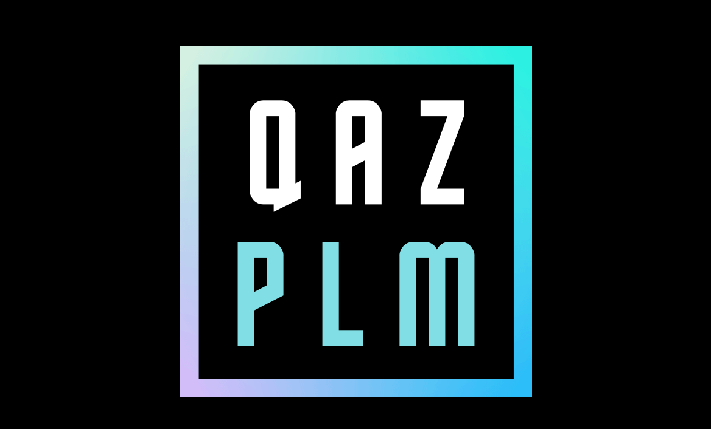
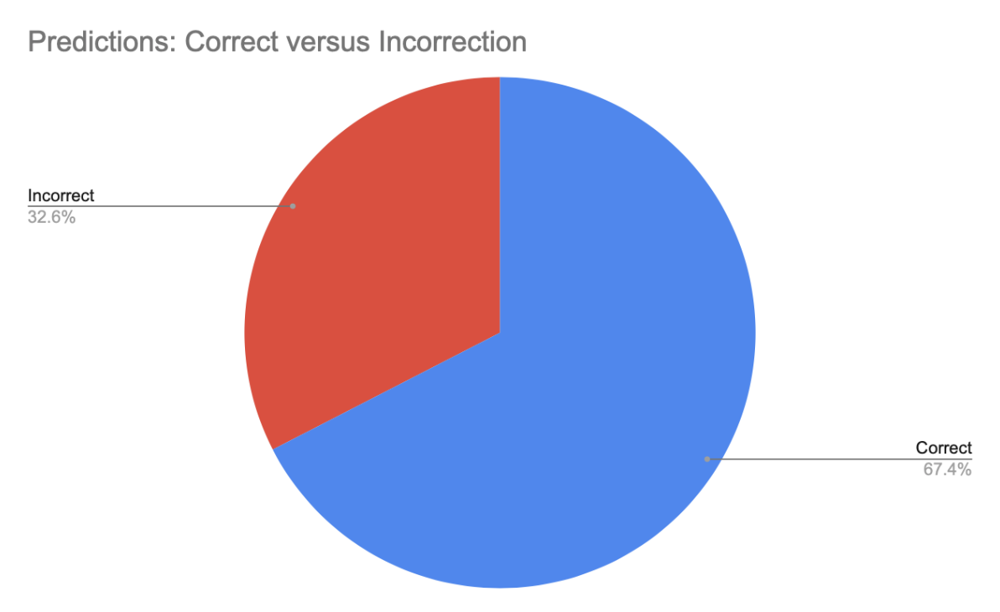

# QAZPLM



The QAZPLM Program demonstrates hidden biases in the inferences made by larger scale algorithms. It does this, indirectly, by asking users to enter as many random letters on their keyboard during four 15-second trials. The program then summarizes the results from each trial, determining what portion of a user's keystrokes were on the left, middle, or right side of the keyboard. These results are then written to a CSV for further analysis.

With this, the computer then makes an inference regarding what handedness the user is. The user's decisions or unnoticed hand bias will determine the computer's handedness inference.

While an incorrect handedness prediction may not seem major, when other algorithms make incorrect assumptions and predictions about a user for say things like advertisements the implications can become more serious.

## Running The Program Using Docker

It is easy to run the QAZPLM program on any machine as the project comes with included Docker files that set up environments specific to the user's machine.

First ensure Docker is installed! You can install [Docker from their website](https://www.docker.com).

Then navigate to the `src` directory of the project in your terminal window by running the command `cd src`.

You can then build the Docker container based on your machine.

### Shortcut to running and building a working container

The following bash scripts simplify building the container.

| OS  | Building  | Running  |
|---|---|---|
| MacOS  		|  `./build_macOS.sh` |  `./run_macOS.sh` |
| Linux   	|  `./build_linux.sh` | `./run_linux.sh`  |
| Windows 	|  `build_win.bat` 		|  `run_win.bat` |


These files may be found in the directory, `docker/` and require the `DockerFile`, which is found in the `src` directory.

We show an example of how to build and run a container for **MacOS** below.

#### Example of and running a Docker container
Again, ensure you are in the `src` directory.

To build the container, `./docker/build_macOS.sh` and to run the container, `./docker/run_macOS.sh`.

### Running the QAZPLM program in a Docker Container

After building and entering your container by running the Docker commands above, you are ready to run the QAZPLM program.

Again ensure you are in the `src` directory.

To run the program, you can then run the command `python3 qazplm.py`

## Running the Program using Pip/Python3

If you have Pip and Python3 installed on your machine, you can use Pip to install the necessary dependencies.

Run the command `pip install prettytable`. Then navigate to the `src` directory and run `python3 qazplm.py` to run the program.


### Other Packages

The other packages used by this program are `thermios, sys, tty, csv, random, time, threading`. If you encounter errors try to `pip install` these.

For instance, to install `thermios`, run `pip install thermios` or run `pip3 install thermios` depending on your machine!


## Running the Program using Pipenv
Make sure Python(3) and Pipenv are installed on your machine. Find information on installing pipenv [here](https://pipenv-fork.readthedocs.io/en/latest/install.html).

### Pipenv

The project comes with a `Pipfile` in the `src` directory that will install the necessary packages for the program, making it easy for users with Pipenv to run the project on their machines.

First navigate to the `src` directory using `cd src`. Then run the command `pipenv lock` to install the necessary Python packages.

You can then run the command `pipenv run python3 qazplm.py` to run the program.


## Results Explained

```
+----------------+--------------------+--------------------+--------------------+--------------------+
|    Trial #     | Total Letter Count |       Left %       |      Middle %      |      Right %       |
+----------------+--------------------+--------------------+--------------------+--------------------+
|       1        |        139         | 14.388489208633093 | 28.776978417266186 | 56.83453237410072  |
|       2        |        112         | 3.571428571428571  | 69.64285714285714  | 26.785714285714285 |
|       3        |        177         | 2.2598870056497176 | 14.689265536723164 | 83.05084745762711  |
|       4        |        238         | 11.344537815126051 | 52.94117647058824  | 35.714285714285715 |
|     Total      |        666         | 8.258258258258259  | 40.54054054054054  | 51.201201201201194 |
| Generated Data |        666         |  7.04647676161919  | 39.430284857571216 | 53.52323838080959  |
+----------------+--------------------+--------------------+--------------------+--------------------+


* Based on your inputted letters, we would guess you are right-handed.
```

Here is a results table that is displayed at the end of the program. It displays the trial, the number of letters entered for a given trial, and the percentages for where letters were entered on the keyboard.

In addition to the regular trials, the table also contains a "Total" trial row which sums all the data from each trial together. This gives the user a good picture of their overall results. It also contains a "Generated Data" trial row which contains the results of randomly generating another letter dataset the same size as Total, with the letters being randomly picked based on probabilities derived from the percentages of individual letters entered by the user. This helps paint a picture of how an algorithm can manipulate data and if the data is biased (heavy in one area) how that can affect this manipulation.

### Class Exercise Results

A class of CS301 (Data Analytics) students used the tool, answering questions like those found in `questions.md`. With this, they also inputted their results into a [collaborative Google Sheet](https://docs.google.com/spreadsheets/d/11KEex7QNXOqKhE-nQtkI5_tfjOIAzmh_OLlZn8G2vhg/edit?usp=sharing) (which can be accessed with an `@allegheny.edu` account).

Through 44 trials the results of the program's handedness prediction were mostly correct, with an accuracy of 67.4%.



## Ideas, Issues, or Praise?

Feel free to make an Issue in the Issue Tracker if you encounter any bugs or have ideas. Make a fork/PR to contribute to the project.
